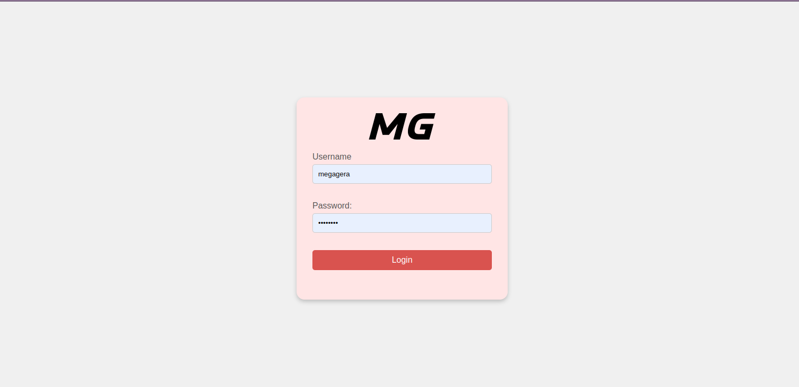

# MegaAuth

**MegaAuth** is a service within [**Mega microservices architecture**](https://github.com/MegaGera/Mega).

*MegaAuth* is an authentication and authorization service that validates and verifies the access of the users to *Mega* applications and services.

## Table of Contents

- [Service Description](#service-description)
  - [User Management](#user-management)
  - [Validation API](#validation-api)
  - [UI](#ui)
- [Part of Mega](#part-of-mega)
- [Dependencies](#dependencies)
- [Environment Variables](#environment-variables)
- [Development Server](#development-server)
- [Build & Deploy](#build--deploy)
- [License](#license)
- [Contact & Collaborate](#contact--collaborate)

## Service Description

This service is divided **user management**, **validation API**, and **UI web page**.

### User Management

*MegaAuth* handles the profiles of users that connects to **all the application and services inside *Mega***.

**Users data structure** is defined in the JavaScript file [`UserRepository.js`](UserRepository.js), and stored using the npm dependency [db-local](https://www.npmjs.com/package/db-local). The passwords are encrypted using [bcrypt](https://www.npmjs.com/package/bcrypt).

The users has different **permissions for each service** and application of *Mega*. There is one **special permission called *Admin*** which allows to perform sensible operations has register users or give permissions.

### Validation API

The *Validation API* is built with [Node.js](https://nodejs.org/en) and [Express.js](https://expressjs.com/). It defines some **interfaces to interact with the users data structure and validate operations** based on the permissions of the user.

[JWT](https://jwt.io/) is used to **keep the users sessions** when they navigate through the different *Mega* services. This JWT is stored in the cookies of the user's browser.

The API exposes various **validation endpoints that are used by the ohter services of *Mega***. These functions validates the permissions for each service. *MegaProxy* uses them for all the requests, and also adds the HTTPS connections.

There are also endpoints that interacts with the user management structure for register users, login, change password, assign permissions...

The source code is in [`index.js`](index.js).

### UI

To handle the users data there is a **UI web page** developed with [ejs](https://ejs.co/) JavaScript templates.

When the user is not log in (there is not JWT in the request or is not valid), the [`login.ejs`](views/login.ejs) view is returned to the user. After log in, the [`admin.ejs`](views/admin.ejs) view is rendered with these features:

- Change password.
- Log out.
- Link to MegaGoal.
- Register Users (Admin).
- Assign Permissions (Admin).

The source code is in [`views`](views) and [public/styles](public/styles).

The static images used in the templates are served by *MegaMedia*.

Login page:



Already running in production in [https://megaauth.megagera.com](https://megaauth.megagera.com).

## Part of Mega

MegaAuth is part of the larger [**Mega**](https://github.com/MegaGera/Mega) project, a collection of web applications built with a **microservices architecture**.

[**Mega**](https://github.com/MegaGera/Mega) includes other services such as a [Proxy (*MegaProxy*)](https://github.com/MegaGera/MegaProxy), a [Footbal App (*MegaGoal*)](https://github.com/MegaGera/MegaGoal), and other Web Applications ([*MegaMedia*](https://github.com/MegaGera/MegaMedia), [*MegaHome*](https://github.com/MegaGera/MegaHome), [*MegaDocu*](https://docusaurus.io/))

## Dependencies

The dependencies and the scripts are defined in the file [`package.json`](package.json) and managed with [npm](https://www.npmjs.com/).

To install the dependencies run the command: `npm install`.

## Environment Variables

In: `.env.development` || `.env.production`

```javascript
SECRET_JWT_KEY=string
PORT=number
```

## Development server

Run `npm run start:dev` for a dev server. The application will automatically reload if detects any change of the source files.

## Build & Deploy

[`Dockerfile`](Dockerfile) file builds the app for production and generates de Docker container.

[`docker-compose.yml`](docker-compose.yml) file manages the image and handle it easily within the *Mega* network.

## License

This project is licensed under the GPL-3.0 License. See the LICENSE file for details.

## Contact & Collaborate

Contact with me to collaborate :)

- gera1397@gmail.com
- GitHub: [MegaGera](https://github.com/MegaGera)


Based on the tutorial of [@midudev](https://github.com/midudev): [Autenticación de Usuario, Sesión, Cookies y JWT con Node.js](https://www.youtube.com/watch?v=UqnnhAZxRac).
